# 29-3-2022
Initialized repository.
Downloaded data from UNITE (QIIME release) https://doi.org/10.15156/BIO/1264708 
Unsure whether to upload the entire database to git, chose not to. 
Running `main.py` with the data calls the new `UniteSubgroups()` class which now splits the data into subgroups based on order.
The taxonomic tree that `UniteSubgroups()` creates is shown in `sample.json`.
The chunk size report shows that this splitting based on order alone is not ideal:

    ---- CHUNK SIZE REPORT ----
    Number: 264
    Size (avg): 201.1060606060606
    Size (std): 712.4163455151829
    Size (min): 1
    Size (max): 9192

# 30-3-2022
New method `split_on_threshold` for spliting chunks based on a threshold value.
It loops through the tree and adds a chunk once its size is below the threshold. 
Experiment run for threshold of 500:

    ---- CHUNK SIZE REPORT ----
    Number: 3353
    Size (avg): 13.301521025946913
    Size (std): 48.34805266927568
    Size (min): 1
    Size (max): 613

Note that the average chunk size is way below 500. High branching trees will result in a big size decrease, thus the threshold value is not an indication of what the chunk sizes will be.
Max chunk size is 613, which is above the threshold. This is only possible for leaves, and depends on the implementation. Unsure what to do with those huge leaves. Found out the leaf with 613 SH's is Aspergillus Flavus.

Ran MAFFT and RAxML with default settings for one of the generated chunks (size 200), which already took 1.12 hours to run. 
Since it was unsure whether the produced tree was valid, the `chunks_to_fasta` method was changed so that it can now include the taxonomy information in the sequences' headers. 

We then ran MAFFT and RAxmL again with a chunk of size 104. This took 0.22 hours. It was still hard to say whether the tree was valid since the taxonomy information is too long to be shown in the plot produced by `PlotTree.py`. However, when zooming in we did observe two seemingly correct clusters (Lecytophora and unidentified). 

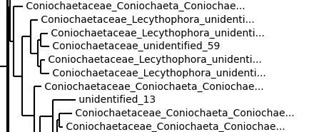

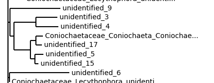

# 5-4-2022
Replaced splitting methods with generalized `split` method, which will split into chunks until a certain `min_depth` is reached. After this `min_depth`, chunks that are bigger than the `max_size` (if specified) will be splitted up further until the `max_depth` is also reached. See below the chunk size report for `min_depth=3` (order), `max_depth=4` (family), and `max_size=1500`.

    ---- CHUNK SIZE REPORT ----
    Number: 463
    Size (avg): 110.09935205183585
    Size (std): 274.2335851854047
    Size (min): 1
    Size (max): 3052

Also see the distribution of the resulting chunk sizes below (compared to splitting on order only)

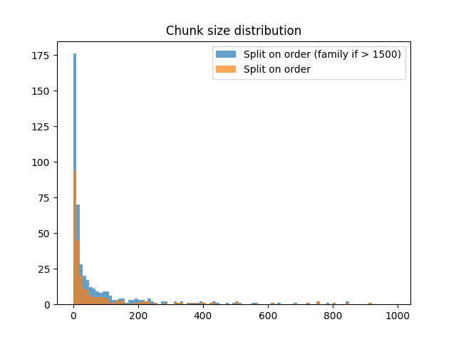

This method of splitting up based on order and only making an extra split on family is the exact method as proposed by Vincent and Rutger. With the generalized implementation, this would allow us to do a more structured experiment with the different chunk sizes to see what's best. Or maybe just go with the one described above since the results seem pretty ok.

Tried running MAFFT and RAxML for the biggest chunk (size 9192, Basidiomycota_Agaricomycetes_Agaricales). MAFFT finished within 20 minutes, [here](5-4-2022/result_modified.fasta) is an idea of what the output looked like (first two seqs). The huge number of insertions doesn't seem very good. RAxML didn't finish, but got to the 3rd bootstrap tree after 15 hours (Intel Core i7 8th gen, 4 threads). 

# 6-4-2022
Created a method that will paste one tree into another tree.
It is possible to select a subpart of a tree by name or length of the branch.
Then the parameters of this subtree are mutable, including the clades inside this subtree.
This way the new tree will be entered in the place you want.
This will look as follows:

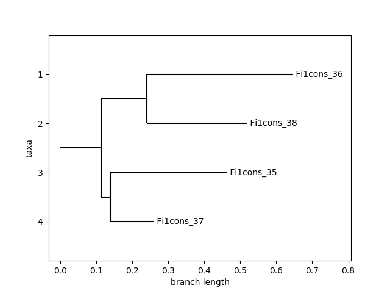

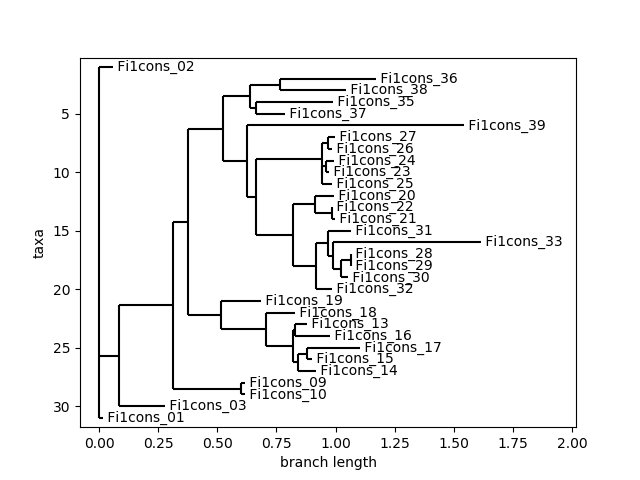

This will result in:

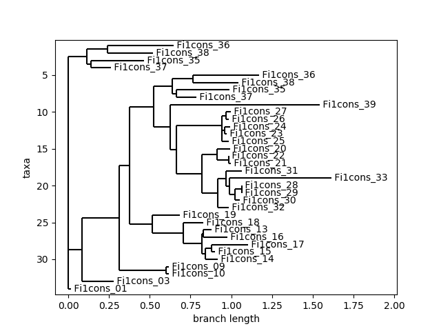

# 7-4-2022
Implemented the distance calculation with `alfpy`, using the `w-metric` system.
I have tested it on the ITS sequences, we got from Vincent, when adding a new sequence. Selecting the 5 best results will show where in the tree the new sequence belongs best. Then I retrieved the Most Recent Common Ancestor `(MRCA)` in the tree from these sequences. The next step is to select all sequences in the clade of this MRCA and create a new fasta file which can be used for the alignment.

# 8-4-2022
From the MRCA, all childs are derived in a recursive function.
From all these childs a new fasta file is created, including the new sequence.

# 10-4-2022
Ran MAFFT and RAxML for the chunk Basidiomycota Agaricomycetes Thelephorales Thelephoraceae (split on order, size 1688) on my own laptop (Intel Core i7 gen 8). MAFFT finished quickly, RAxML took 1.822125 days. Settings have been stored in the results folder. Results were inspected using [mesquiteproject](http://www.mesquiteproject.org/). The alignment seemed valid but contained many empty insertions at the end of the sequences. As for the tree, the chunk contained many sequences of the same family (tomantella), but we observed that the sequences who were not in this family but in a different one were clustered together which seemed positive. See the visualizations below.

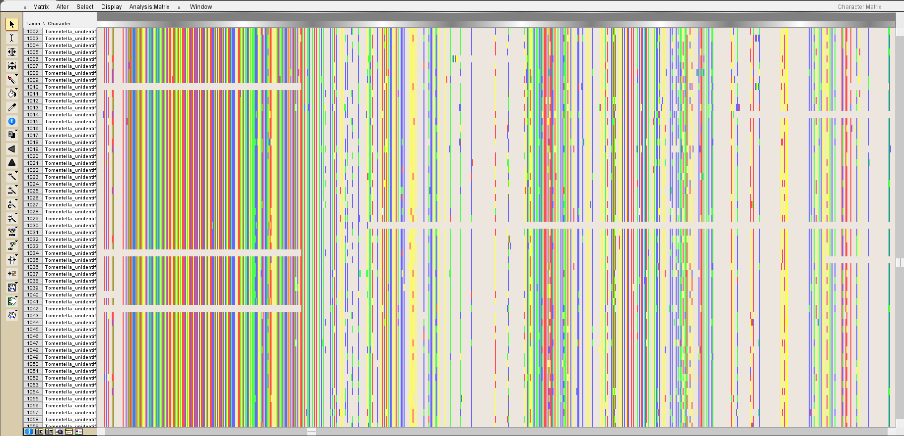

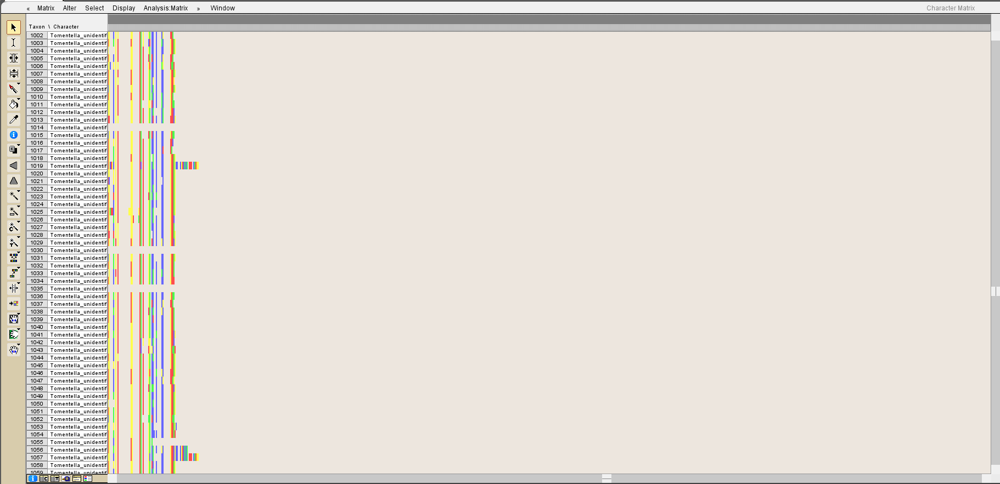

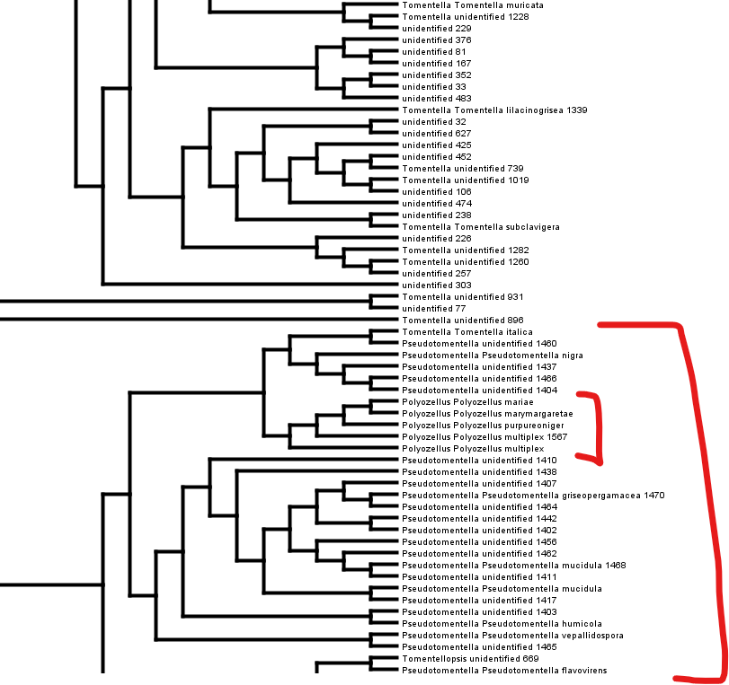

# 13-4-2022
We approach outgroup identification as follows: for each sequence that is not in the ingroup, we calculate the average distance to the ingroup. The 10 sequences with the lowest such distance are considered to be the outgroup. As a distance measure we use alignment-free methods from the `alfpy` package.

Despite being alignment-free, calculating pairwise distances is still rather slow. Thus, we fill a mysql database once and then read the data from this database with the sequences as indices for quick retrieval. A 41000×41000 pairwise distance matrix can be stored as (41000×41001)/2 = 840 520 500 rows in a database (as the matrix is symmetrical). With every row being 12 bytes (4+4+4 for seq_1, seq_2, float value), this database will be 9.39 GB big.

Filling the database for the first 500 sequences with all their 500×41898 pairwise distances (which is 0.025% of the total) already took 1.04 hours on my personal computer (Intel Core i7). Filling the entire database would then take about 40 hours. We haven't done this yet. The `w-metric` method from `alfpy` was used to calculate the distances, k-mer distance was also implemented but this was even slower.

A new `ConnectDatabase` class was made to facilitate the above, and `UniteSubgroups` now communicates with this new class when it recognizes the distance database is not yet present on the current system, to initialize the calculation. Once this distance database is present, the `identify_outgroup` method can be called to retrieve the 10 sequences with lowest distance to the ingroup. I was unable to come up with a query that could do this in once (without becoming extremely slow) so I loop over the sequences with Python and then pick the best 10. This method is not very quick either. For the first 500 sequences and an ingroup with size of 100, it took 89 seconds to calculate the 10 closest sequences. It might take about an hour (or more) to then do this when the entire database is filled. For 463 chunks that all need outgroups, that is quite a lot... 

# 15-4-2022
We used a package to call `MAFFT` and `RAxML` from within the python file.
So now the code is able to loop over all new data points and add these to the tree.
First of all it does a check if the new sequence does not already exist in the tree.
If it is indeed a new sequence, it uses the `alfpy` package to calculate the distance to all other sequences in the tree. Based on these distances the three closest sequences are selected.
From these three, the `MRCA` is retrieved, and then all of its kids. 
These sequences are then re-alligned with the new sequence in MAFFT.
The new allginment is then used in RAxML to create the new subtree.
The last step taken is to replace the old subtree, under the found MRCA, with the newly created subtree.

With the data we got from Vincent, this will results in the following figure:
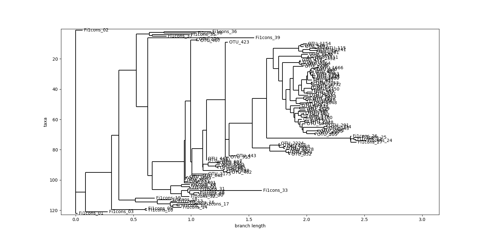

Or draw the tree from (15-4-2022/new_ref_tree.newick)

# 20-4-2022
About the new code structure:
* `Chunks.py` dividing data from UNITE into chunks. (previously `UniteSubgroups.py`) 
    * `Chunk`: contains indices corresponding to sequence data in its `ingroup` and `outgroup` attributes.
    * `chunk_size_report`
    * `UniteData`: contains sequence and taxonomy data from a UNITE release and methods that use this data (like `chunks_to_fasta`).
* `DistanceData.py`: storing the distances between sequences in a database.
    * `PairwiseDistances`: calculating and using the pairwise distance data.
    * `ConnectDatabase`: setting up a database connection.

`PairwiseDistances` now contains a `determine_outgroup` method for chunks, and the code supports dumping the entire chunk to FASTA (ingroup + outgroup). Given this new functionality, two experiments were done. Note that only limited distance data was available (only first 600 rows of matrix).

## Outgroup try-out, small chunk
The alignment for the chunk _Ascomycota Eurotiomycetes Eurotiales Thermoascaceae_ with size 56 and with outgroups included is shown below. The outgroups align ok except for one. Maybe this problem will be solved once more pairwise distances are available. It is actually noteworthy that the alignment does so well given that only 600 rows of the distance data are available. Maybe we don't need to search the entire matrix to find suitable outgroups? Maybe we can stop at a threshold distance value? 

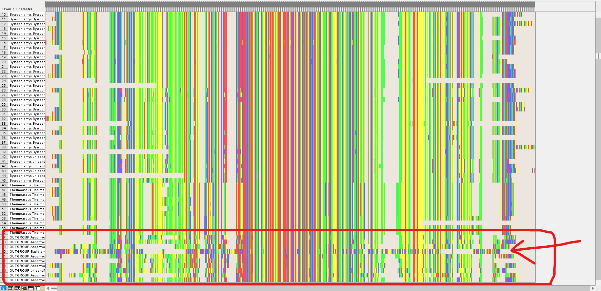

The alignment was used to build the tree below. 10 outgroups were used and inputted using the `-o` flag of raxml. However, this resulted in the following user warning: `outgroups are not monophyletic, using first outgroup from the list to root the tree!` 1 and 4 below are still look like outgroups. Maybe 2 is ok too. But 3 is pretty nested in the tree, which should not be happening for an outgroup. 

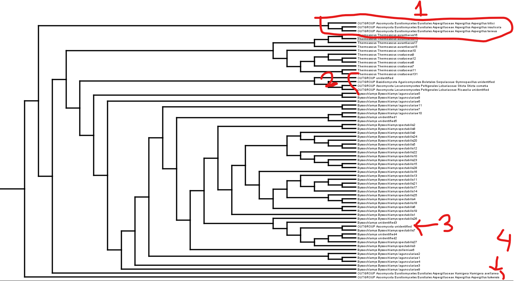

## Outgroup try-out, big chunk
The alignment for the chunk _Basidiomycota Agaricomycetes Agaricales Cortinariaceae_ with size 1002 and with outgroups included is shown below. The outgroups seem to align relatively well. Not sure about the overall quality of the alignment.

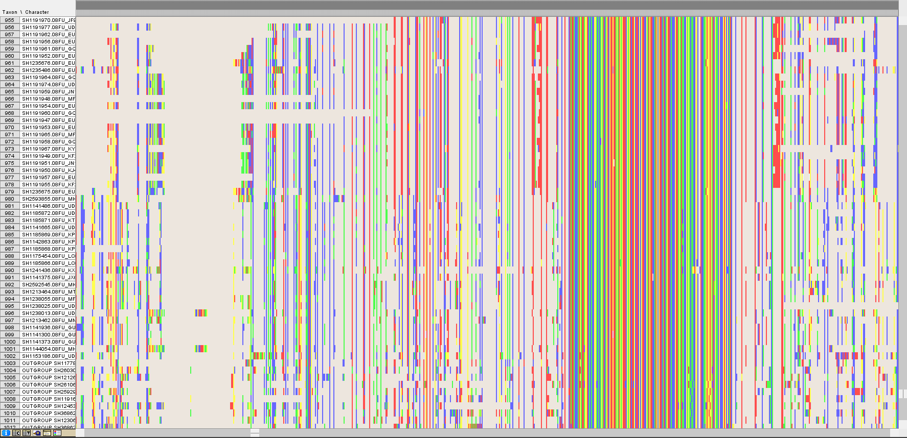